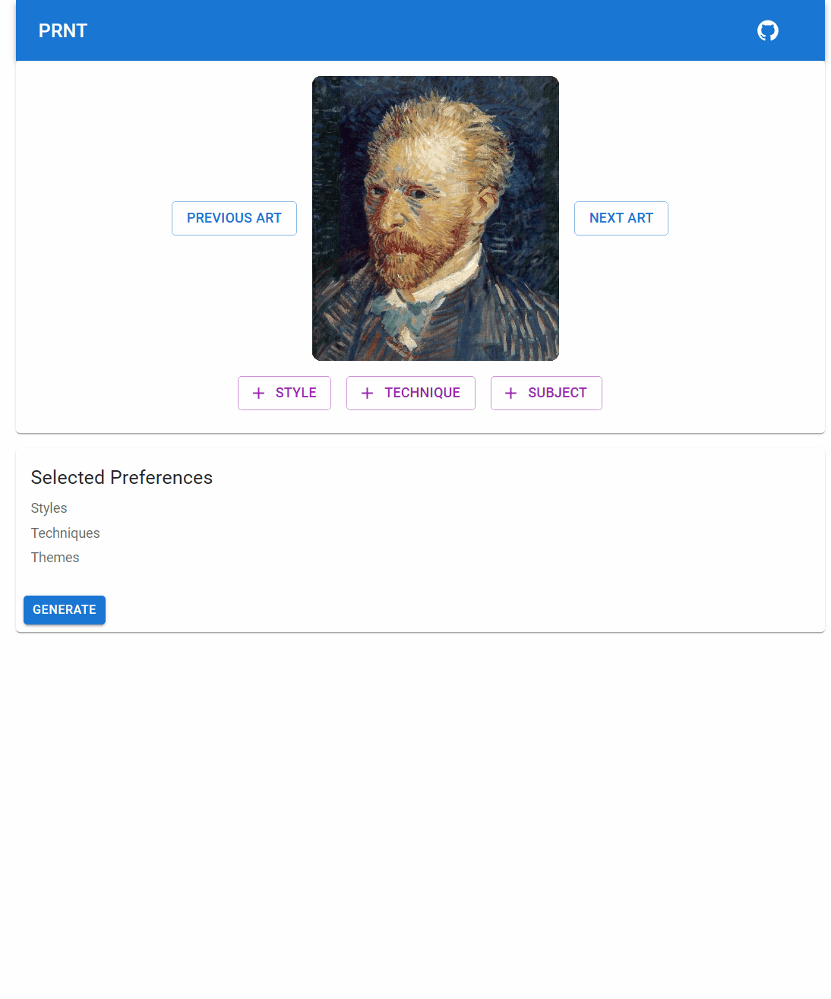

# Simple UI to create art

This application integrates [ChatGPT3](https://openai.com/blog/chatgpt/) and [DALL-E 2](https://openai.com/dall-e-2/) to revolutionize the way you create art! You can easily select and combine different properties from various pictures to generate unique and personalized pieces of art. Simply choose the features you like, and let the AI do the rest. Whether you're a professional artist or just looking to have some fun, this is a perfect tool for unlocking your creativity

# Demo

[prnt-ui-poc.netlify.app](https://prnt-ui-poc.netlify.app/)

# Hosting

The demo app is hosted on [Netlify](https://www.netlify.com/) and the images are on [Amazon S3](https://aws.amazon.com/s3/)
